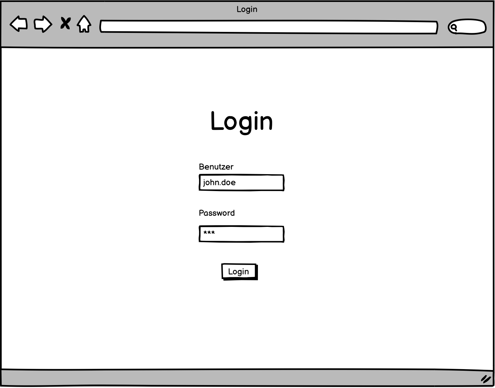
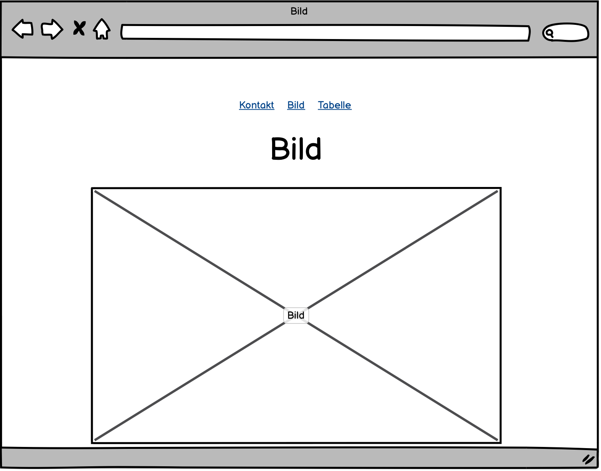
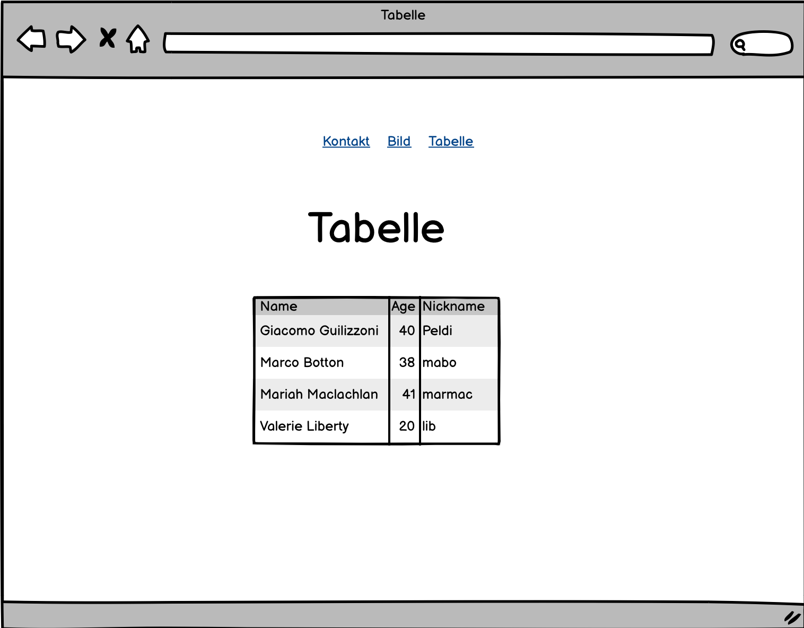

## Aufgabe 1

Nun hast du einige Tags kennengelernt, welche dir ermöglichen eine einfache Webseite zu bauen. Jetzt liegt es aber an dir, diese Erkenntnisse in einer Webseite einzubauen. Erstelle als erstes ein simples Kontaktformular. Denk daran, der beste Freund eines Softwareentwicklers ist das Internet. Das Internet steht dir also jederzeit zur Verfügung.

Dein Kontaktformular sollte folgende Punkte aufweisen.

- Eine Überschrift (Titel)

- Eingabefelder für:

  - Ein Menu zur Auswahl der Anrede

  - Vornamen

  - Nachname

  - E-Mail Adresse

- Ein Button, um das Formular abzusenden (muss nicht funktionieren)

## Aufgabe 2

Füge mehrere Seiten zu deinem Formular hinzu. Am Schluss soll es 4 Seiten, inkl. Kontaktformular, geben. 
Jede seite soll ein separates HTML File haben. Die Darstellung und Inhalt der Seite soll gemäss den Mockups
umgesetzt werden. Für die Darstellung kannst du CSS verwenden.

