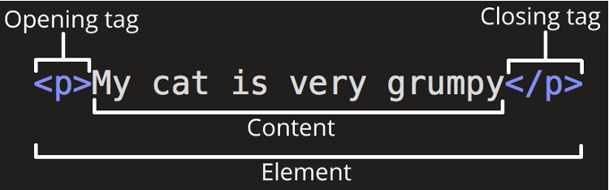
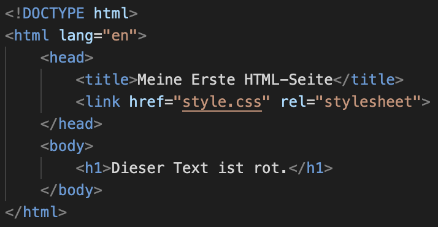
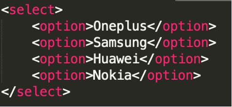
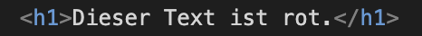
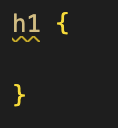
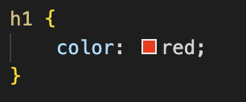
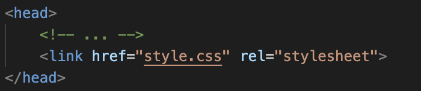

# HTML



HTML steht für _Hyper Text Markup Language_. Fast überall im Internet findet man HTML. Auch in E-Mail Newslettern wird HTML gerne gebraucht.  


## Tags im Allgemeinen

Tags sind Anweisungen in spitzen Klammern. Ein vollständiges Tag benötigt dabei immer ein öffnendes (*&lt;p&gt;*) und schliessendes (*&lt;/p&gt;*) Tag. Ein HTML-File stellt sich aus drei grundlegenden Tags zusammen. Nämlich dem &lt;html&gt;, &lt;head&gt; und &lt;body&gt;. Zusätzlich gibt es noch hunderte weitere solche Tags mit verschiedensten Anweisungen. Diese können auch ineinander verschachtelt werden.

### _Beispiel_:


> Siehe Beispiele für Tags unter: [w3schools.com](https://www.w3schools.com)


## Div-Container

Ein Div-Container kann verwendet werden um Teile der Webseite besser zu strukturieren oder zum CSS-Klassen identifizieren. Dabei ist zu merken, dass Div-Containers in der natürlichen Form über keine Farbe, fixe Grösse oder sonstige Eigenschaften besitzen.


## Text-Eigenschaften
### Titel
Um einfache Überschriften zu generieren, können die Tags **&lt;h1&gt;** bis **&lt;h6&gt;** verwendet werden.

### Paragraph
Um Texte einfach strukturieren zu können wird häufig der **&lt;p&gt;** Tag verwendet.

### Zeilenumbruch
Um einen Zeilenumbruch zu forcieren kann der **&lt;br&gt;** Tag verwendet werden.

### Kursiv
Für eine kursive Schrift kann der HTML-Tag **&lt;i&gt;**.

### Bold (Fett)
Für eine fette Schrift wird der **&lt;b&gt;** Tag verwendet werden.


## Eingabefeld

Um ein Eingabefeld zu erstellen, kann das **&lt;input&gt;** Tag  verwendet werden. 

 

Der _type=”...”_ Parameter muss verwendet werden, um dem Input Tag mitzuteilen, um welche Art von Input es sich handelt. 

> Hier findest du die Liste mit allen Formen des Inputs: [w3schools.com/tags/att_input_type.asp](https://www.w3schools.com/tags/att_input_type.asp)


## Buttons

Um einen Button in die Webseite einzubinden wird der **&lt;button&gt;** Tag verwendet. Der Button ist oftmals das Bindeglied zwischen der Webseite und der Logik.


## Dropdown Menu

Das Auswahlmenü wird oftmals auch als ComboBox bezeichnet. Die ComboBox setzt sich aus mehreren Tags zusammen. Siehe Beispiel:



<br>
<br>
<br>
<br>

# CSS

CSS (_Cascading Style Sheets_) ist eine Sprache, die verwendet wird, um das Aussehen und Layout von HTML-Dokumenten zu gestalten. Es ermöglicht, Farben, Schriftarten, Abstände und andere visuelle Eigenschaften festzulegen, um Webseiten ansprechender zu gestalten. CSS arbeitet zusammen mit HTML, wobei es die Trennung von Inhalt und Darstellung ermöglicht.

## Selektoren & Deklarationen
Ein CSS-Dokument besteht aus _**Selektoren**_ und _**Deklarationen**_.<br><br> _**Selektoren**_ wählen HTML-Elemente aus, auf die die Stile angewendet werden sollen.
<br>
<br>
### _HTML:_

### _CSS:_

<br>
<br>
Die _**Deklarationen**_, die zwischen den geschweiften Klammern stehen, etnhalten Eigentschaften und Wete, die das Aussehen der ausgewählten Elemente definieren. Jede Deklaration ist in der Form "Eigenschaft: Wert" geschrieben, getrennt durch ein Semikolon. 
<br>
<br>
### _CSS_:

<br>
<br>

## Häufigste Deklarationen

### **color**
Mit dem _color_-Attribut kannst du die Farbe eines Textes ändern. Dabei kannst die die Farbe direkt schreiben 
<br>```color: red;```
<br> oder den Farben-Wert als HEX- oder RGB-Wert schreiben (für mehr Auswahl)
<br>```color: #3ff1a1;```
<br>```color: rgb(255, 255, 0);```
<br>
### **background-color**
Mit dem _background-color_-Attribut kannst du die Hintergrundfarbe eines Elements ändern. Dieses ist gleich wie das _color_-Attribut aufgebaut.
<br>```background-color: red;```
<br>```background-color: #3ff1a1;```
<br>```background-color: rgb(255, 255, 0);```
<br>

### **width** & **height**
Mit den _width_- und _height_-Attributen kannst du die Breite und Höhe eines Elements definieren. z.B.
<br>```height: 200px;```
<br>```width: 100%;```
<br>

### **border**
Mit _border_ kannst du einen Rahmen um ein Element erstellen. z.B.
<br>```border: 1px solid black;```
<br>

### **margin** & **padding**
Mit _margin_ und _padding_ kannst du Abstände rund um ein Element definieren. Bei _margin_ handelt es sich dabei um den inneren Abstand zum Rand, bei _padding_ hingegen um den Abstand nach Aussen. z.B.
<br>```margin: 10%;```
<br>```padding: 20px;```
<br>```margin-top: 10px;```
<br>```margin: 10px 20px 10px 10px;``` (oben, rechts, unten, links)
<br>
<br>

> Für weitere Deklarationen siehe [w3schools.com/css/](https://www.w3schools.com/css/)


<br>
## Verbindung mit HTML

Um eine CSS-Datei in dein HTML einzubinden, verwende das **&lt;link&gt;** Element. Dies muss innerhalb des **&lt;head&gt;** Tags deines HTMLs eingebaut werden. Das _href_-Attribut soll den Pfad zu deiner CSS-Datei enthalten und das _rel_-Attribut sollte auf _"stylesheet"_ gesetzt sein.

### _Beispiel_:



Nun kannst du dein HTML-Dokument mittels Doppelklick im Browser öffnen. Das Resultat sollte etwa folgend aussehen: 


